# GoodFoods

This is a community based app meant for both store owners and customers alike. For store owners
this is an avenue to advertise your delicious foods and for customers this is a great tool
to look for good foods near you!

## Tech Stack

**Database:** MongoDB, Mongoose

**Server:** Node, Express

**Client:** React

## Link

https://goodfoods.herokuapp.com/

## Features

-   Registration and Login for store owners and public users
-   Map with a draggable marker to locate good foods near you
-   Browse menu of stores
-   Toggle to display all good foods registered in the app on the map
-   Click on markers to navigate to that particular store
-   Logged in public users can create, edit and delete comments on foods
-   Logged in store owners have access to create store and locations, bundled with full suite of store management utilities

## How to use

Allow the app to access your current location if you want to find good foods near you.
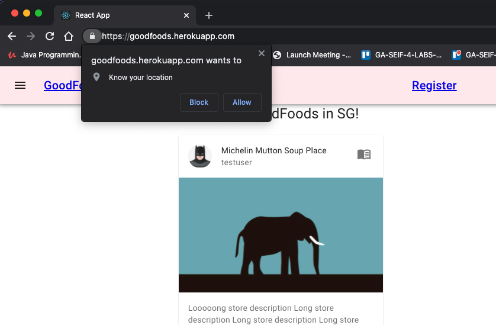

If you are near(within 800m) a store that is registered on the app, it will be displayed by a marker.
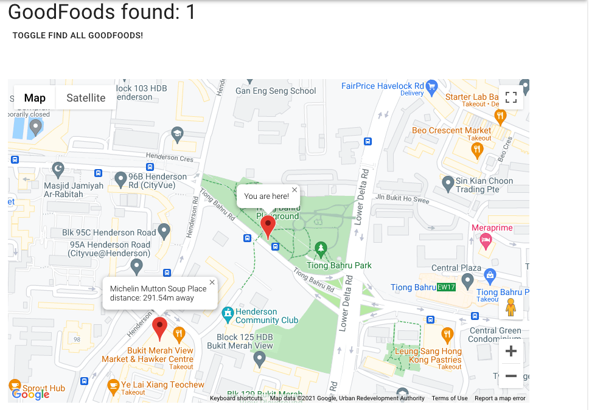

If the location is not accurate, you can move your marker to the actual location which you are at on the map.
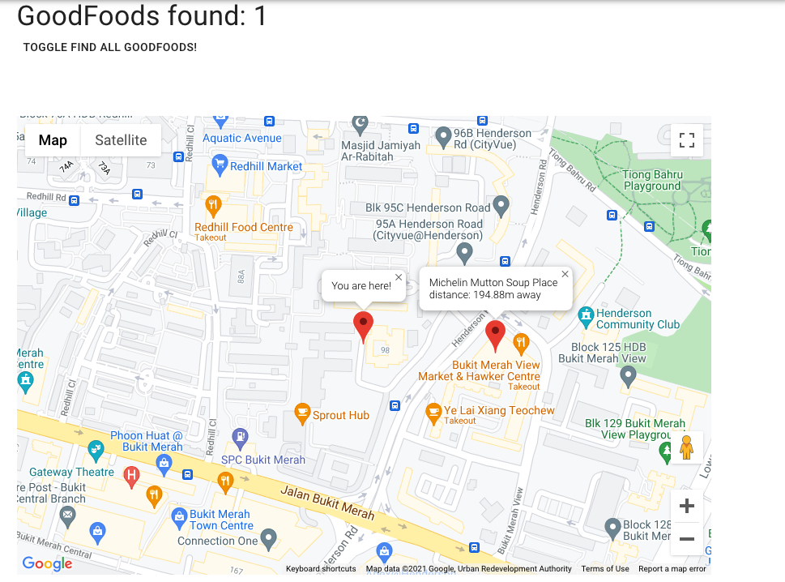

Click the toggle button to display all good foods registered on the app. Zoom out to have a better overall view.
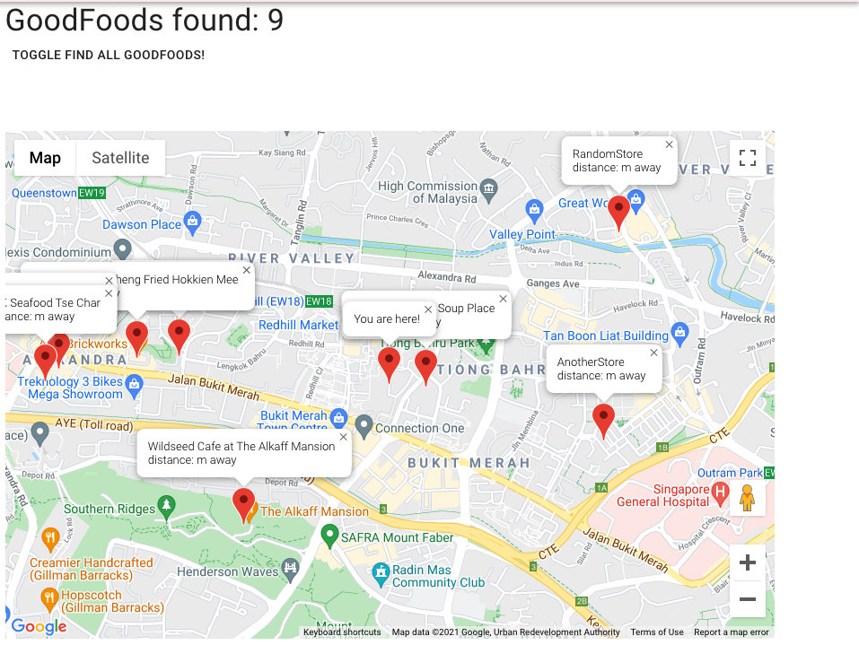

Click on the 'open book' icon to browse a store's menu.
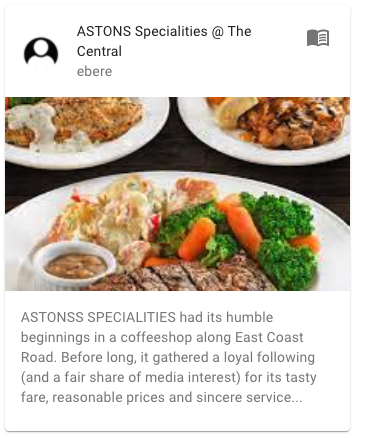

For new users, register an account to comment on foods. If you are a store owner, click the owner radio button. The avatar image will be displayed on your store and food cards.
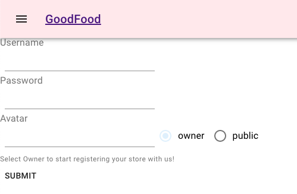

You can comment on the store's food in the menu page.
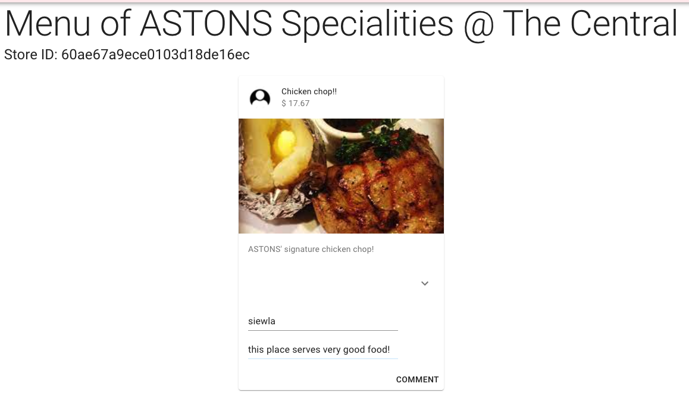

You can edit your comment by clicking on the 'pencil' icon to reveal a textbox. Press ENTER once you are done editing to save changes. Click the 'trash bin' icon to delete your comment.
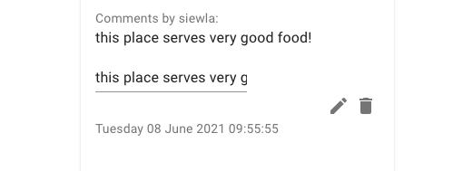

For store owners, after logging in. Click the 'profile' icon at the top right corner to access your store homepage.
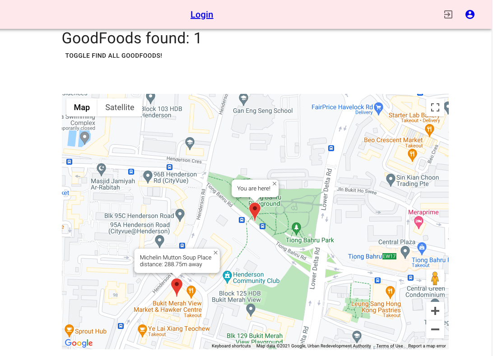

In your store homepage, you can create stores, edit your stores and create a location of your store on the map
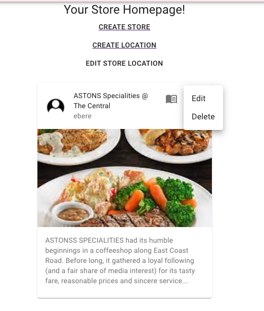

Click the 'Create Store' button to start creating a store and place its location on the map.
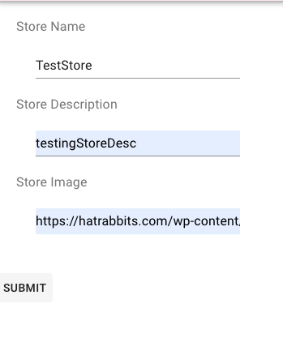

You will need the store ID in the notistack, copy it. The location store name should be the same as your store's name.
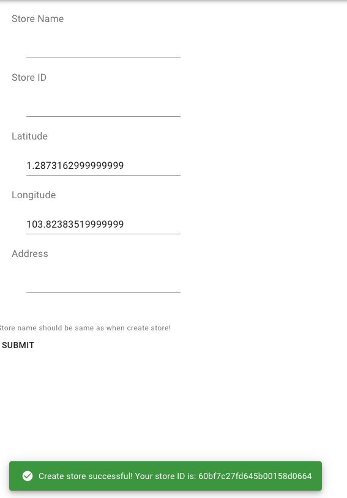

Entering your store's coordinates and address is easy, just drag the marker on the map to your store's location and the coordinates and address will be automatically input into the form.
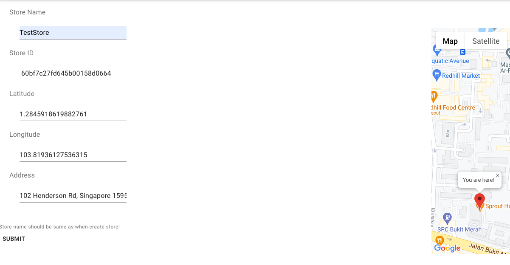

If you entered any store details incorrectly, you can still edit it.
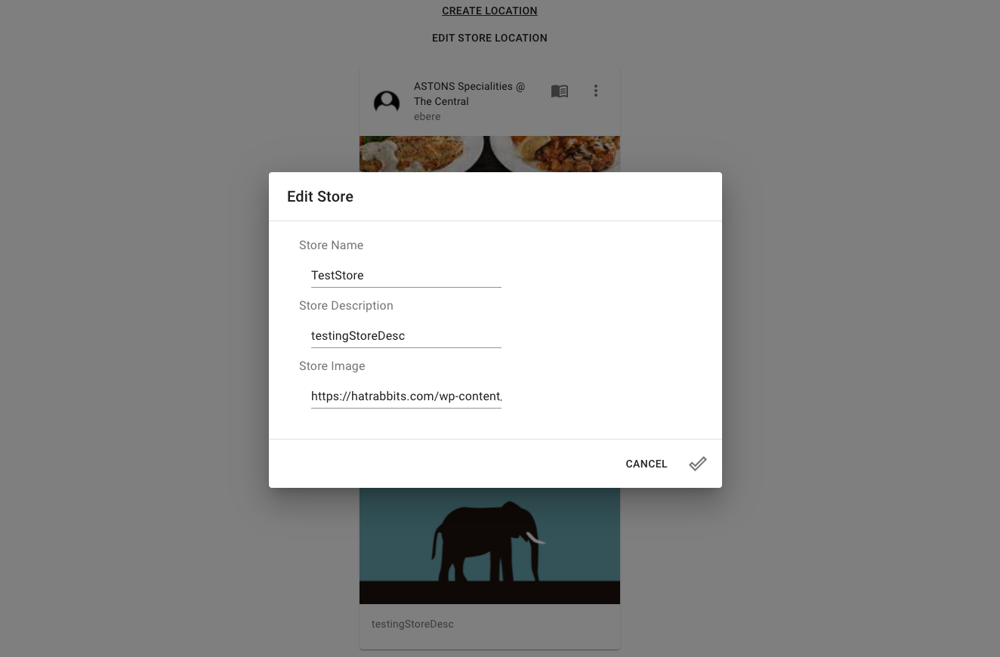

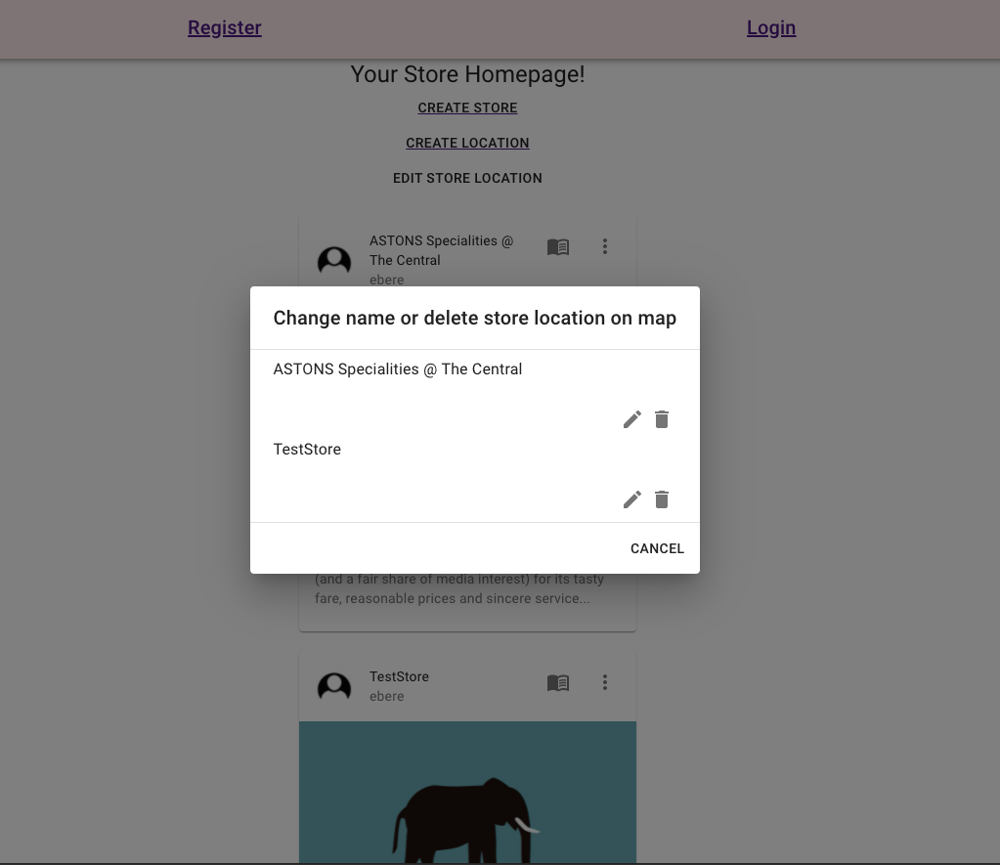

## Endpoints

#### Create new user

```http
  POST /auth/signup
```

#### Sign In

```http
  POST /auth/login
```

#### Sign Out

```http
  DELETE /auth/logout
```

#### Get All Stores

```http
  GET /food
```

#### Create Store

```http
  POST /food
```

#### Edit Store

```http
  PUT /food/${id}
```

| Parameter | Type     | Description               |
| :-------- | :------- | :------------------------ |
| `id`      | `string` | **Required**. Id of store |

#### Delete Store

```http
  DELETE /food/${id}
```

| Parameter | Type     | Description               |
| :-------- | :------- | :------------------------ |
| `id`      | `string` | **Required**. Id of store |

#### Create Food

```http
  POST /food/${id}/menu
```

| Parameter | Type     | Description                                 |
| :-------- | :------- | :------------------------------------------ |
| `id`      | `string` | **Required**. Id of store to create food in |

#### Edit Food

```http
  PUT /food/${id}
```

| Parameter    | Type     | Description               |
| :----------- | :------- | :------------------------ |
| `id`         | `string` | **Required**. Id of store |
| (query) `id` | `string` | **Required**. Id of food  |

#### Delete Food

```http
  DELETE /food/${id}/menu
```

| Parameter    | Type     | Description               |
| :----------- | :------- | :------------------------ |
| `id`         | `string` | **Required**. Id of store |
| (query) `id` | `string` | **Required**. Id of food  |

#### Create Comment

```http
  POST /food/${id}/comment
```

| Parameter    | Type     | Description                                   |
| :----------- | :------- | :-------------------------------------------- |
| `id`         | `string` | **Required**. Id of store to create food in   |
| (query) `id` | `string` | **Required**. Id of food to create comment in |

#### Edit Comment

```http
  PUT /food/${id}
```

| Parameter    | Type     | Description                 |
| :----------- | :------- | :-------------------------- |
| `id`         | `string` | **Required**. Id of store   |
| (query) `id` | `string` | **Required**. Id of food    |
| (query) `id` | `string` | **Required**. Id of comment |

#### Delete Comment

```http
  DELETE /food/${id}/comment
```

| Parameter    | Type     | Description                 |
| :----------- | :------- | :-------------------------- |
| `id`         | `string` | **Required**. Id of store   |
| (query) `id` | `string` | **Required**. Id of food    |
| (query) `id` | `string` | **Required**. Id of comment |

#### Get All Locations

```http
  GET /location
```

#### Get locations by center radius

```http
  GET /location/store
```

| Parameter      | Type     | Description                                 |
| :------------- | :------- | :------------------------------------------ |
| (query) `lat`  | `number` | **Required**. Latitude of current location  |
| (query) `lng`  | `number` | **Required**. Longitude of current location |
| (query) `dist` | `number` | **Required**. Radius to search              |

#### Create Location

```http
  POST /location
```

#### Edit Location

```http
  PUT /location/${id}
```

| Parameter | Type     | Description                  |
| :-------- | :------- | :--------------------------- |
| `id`      | `string` | **Required**. Id of location |

#### Delete Location

```http
  DELETE /location/${id}
```

| Parameter | Type     | Description                  |
| :-------- | :------- | :--------------------------- |
| `id`      | `string` | **Required**. Id of location |
